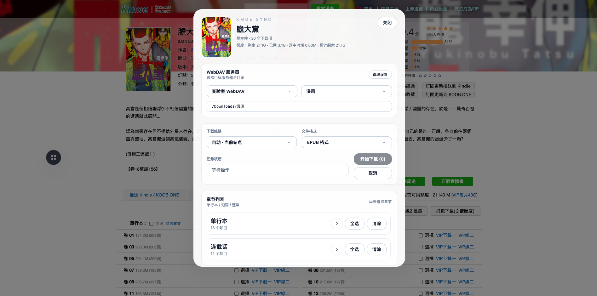

# Kmoe Sync

[中文说明](../README.md)

## Overview
Kmoe Sync is a Chrome extension that injects a floating downloader on kxx.moe mirror sites and uploads the chapters you pick to your own WebDAV server. The UI is built with Tailwind-style components and works completely offline.

## Features
- **Download history** – review every task with status, finish time, save path, and error messages, plus keyword search and expandable details.
- **WebDAV management** – add multiple servers with path presets and a remote directory browser for quick insertion.
- **Download rules** – build custom folder/file structures using variables such as `{title}` and `{filename}`.
- **Floating downloader** – open the panel on manga pages, choose line, format, and chapter groups, and monitor quota and logs in real time.

## Installation

### From Store (Recommended)
- **Microsoft Edge**: [Install from Edge Add-ons Store](https://microsoftedge.microsoft.com/addons/detail/jalicelpgjimijnmpmejjhmjpnoilkel)

### Manual Installation
1. Go to [GitHub Releases](https://github.com/solywsh/kmoe-sync/releases) and download the latest version zip file.
2. Extract the downloaded file to a local directory.
3. Open `chrome://extensions/` or `edge://extensions/`, enable Developer Mode, choose "Load unpacked", and select the extracted folder.
4. Verify the icon, permissions, and version on the extension details page.

### From Source (Developers)
1. Clone the repository and install dependencies: `npm install && npm run build:css`.
2. Open `chrome://extensions/` or `edge://extensions/`, enable Developer Mode, choose "Load unpacked", and select this project folder.
3. Verify the icon, permissions, and version on the extension details page.

## Usage
1. On the options page, add your WebDAV server (URL, credentials, default path) and use the browser button to pick a remote directory.
2. On a manga detail page, click the floating button in the lower-right corner to open the downloader.
3. Select the chapters, pick the line/format/path, then click “Start Download”. The Service Worker fetches and uploads files sequentially while logging progress and history.

## Development Notes
- Re-run `npm run build:css` whenever you adjust UI or styles so injected pages receive the latest CSS.
- The Service Worker targets Manifest V3 ES modules; porting to other browsers requires MV3 compatibility.

## Privacy & Security
- Scripts only run on the specified domains, and WebDAV credentials stay inside `chrome.storage`; nothing is sent to external services.
- Use a trusted WebDAV server of your own, and remove demo data before packaging or sharing the extension.

## Support
If you hit an issue, open an Issue with reproduction steps, browser version, and console or history logs so we can help investigate.
